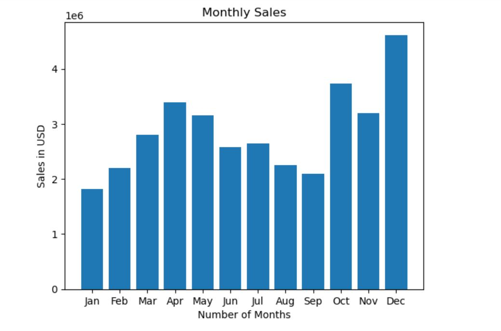
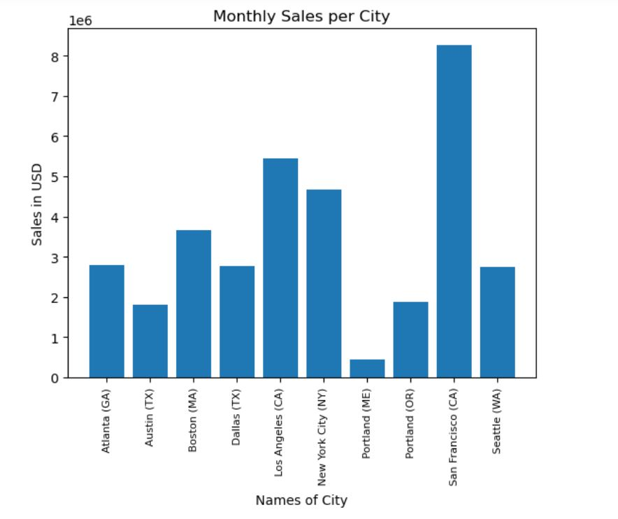
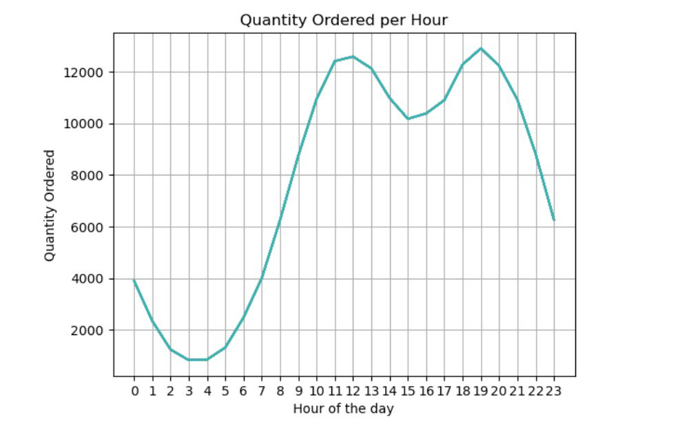
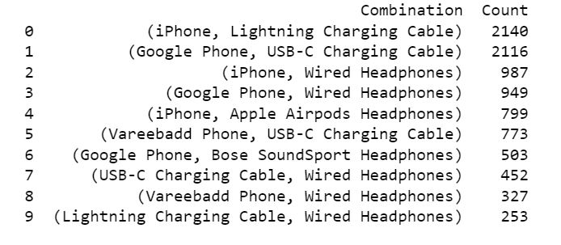
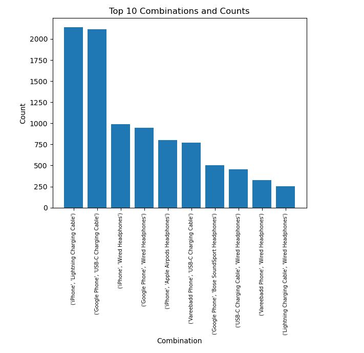
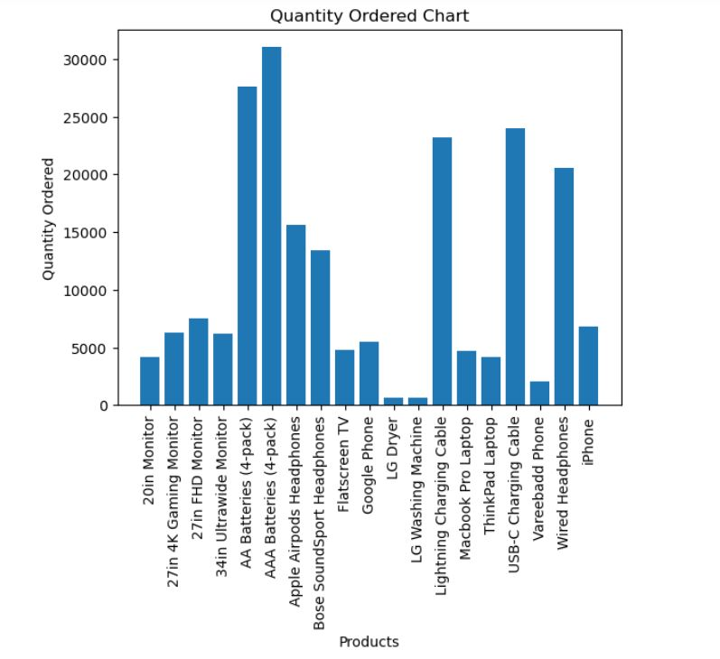
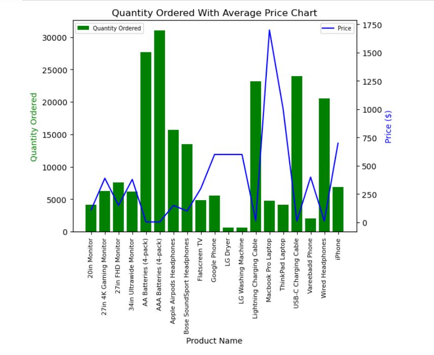

# Electronic-Store-Sales-Analysis

---

## Introduction

This is a project that utilizes **Python** to analyze imaginary sales data from an electronic store. The dataset contains information such as order details, product information, quantities ordered, prices, and purchase addresses. By performing data analysis on this dataset, we aim to gain insights into sales performance, customer behavior, and product popularity. The project utilizes various data transformation techniques and visualization tools to extract meaningful information and provide actionable recommendations.

**_Disclaimer_** : _All datasets and visualizations do not represent any store, but just a dummy dataset to demonstrate capabilities of **Python**._

## Problem Statement

The objective of this project is to analyze the sales data and answer key questions related to sales performance, product popularity, and customer behavior. The specific problem statements addressed in this project include:

1.   **Best Month for Sales:** Determine the month that generated the highest sales and calculate the amount earned during that month.

2.   **Top-Selling City:** Identify the city that sold the most products and analyze its sales performance.

3.   **Optimal Advertisement Timing:** Determine the best time to display advertisements to maximize the likelihood of purchases.

4.   **Frequently Sold Together Products:** Identify the products that are most often sold together to facilitate cross-selling and product bundling strategies.

5.   **Top-Selling Product:** Determine the product that sold the most and analyze possible reasons behind its popularity.

## Skills Demonstrated
The following skills are demonstrated in this project:

- Data cleaning and preprocessing.
- Data merging and augmentation.
- Data grouping and aggregation.
- Data visualization using bar charts, line graphs, and other plots.
- Extracting and manipulating date and time information from the dataset.
- Implementing data analysis tasks using pandas, matplotlib, and other Python libraries.

## Data Transformation Techniques Applied

The project applies the following data transformation techniques to analyze the sales data:

- **Merging Data:** Multiple CSV files containing sales data from different months are merged into a single file using pandas' **_concat_** function.

- **Cleaning Data:** Rows with missing values are dropped using the **_dropna_** function. Rows containing 'Or' in the 'Order Date' column are removed. Columns are converted to the appropriate data types using pandas' to_numeric function.

- **Augmenting Data:** Additional columns, such as 'Month' and 'City', are added to the dataset to enable further analysis and insights.

- **Data Restructuring:** The DataFrame is restructured to keep only the relevant columns for analysis, including 'Order ID', 'Product', 'Quantity Ordered', 'Price Each', 'Sales', 'Order Date', 'Purchase Address', and 'Month'.

## Analytical Insights with Visuals
The project provides several analytical insights accompanied by visualizations. Here are the key insights:

- **Best Month for Sales:**  The analysis reveals that the best month for sales was **December**, with a total sales revenue of **$4,613,443**. This could be attributed to increased holiday shopping and promotional activities during the festive season.
  Below is an image of the bar chart showcasing the monthly sales, highlighting the best month for sales.
  
  

---

- **City with the Most Sales:**  The analysis shows that the city of **San Francisco (CA)** has the highest sales volume, with total sales amounting to **$8,262,203.91**. This suggests that the store should focus on strengthening its presence in San Francisco and tailor marketing strategies to target customers in this area. Below is an image of the bar chart showcasing the monthly sales per city, highlighting the best city for sales.

  

---

- **Optimal Advertisement Time:**  By analyzing the quantity of orders placed at each hour, it is evident that the peak hours for purchases are between **11am** and **1pm**, as well as between **6pm** and **8pm**. To maximize the likelihood of purchases, it is recommended to display advertisements during these time frames. A line graph is used to illustrate the quantity of orders placed at each hour, helping identify the best time for displaying advertisements.

  

---

- **Frequently Sold Together Products:**  The analysis reveals that the most common product combination is the **'iPhone'** and '**Lightning Charging Cable'**, which occurs in 10% of the total orders. This presents an opportunity to create product bundles or offer targeted promotions to customers purchasing these products together.
The top 10 most common product combinations are displayed, providing insights into cross-selling opportunities.

Top Ten Combination List        |  Top Ten Combination chart
:------------------------------:|:--------------------:
         |  

---

- **Best-Selling Product:**  The **'AAA Batteries'** emerged as the best-selling product, with a total quantity ordered of **31,017 units**. This could be attributed to its wide applicability across various electronic devices and the competitive pricing offered by the store. The results are visualized using a bar chart, highlighting the quantity ordered for each product. Additionally, the average prices for each product are plotted alongside the quantity ordered to observe any price-sales correlation.

Quantity Ordered                |  Quantity Ordered with Average Price
:------------------------------:|:--------------------:
         |  

## Conclusion

In this data analysis project, we have successfully analyzed sales data to gain insights into various aspects of the business. By merging, cleaning, and transforming the data, we were able to answer important questions related to sales performance, city-wise sales, optimal advertising time, frequently sold product combinations, and the best-selling product.

Through the analysis, we identified the best month for sales, the city that sold the most products, and the recommended time for displaying advertisements to maximize the likelihood of purchases. We also discovered frequently sold product combinations and determined the best-selling product.

# Recommendation

Based on the analysis, we make the following recommendations:

_Focus on the best-performing month_: Allocate resources and marketing efforts towards the identified best-performing month to maximize sales potential during that period.

_Target high-performing cities_: Prioritize marketing and sales strategies in the city that demonstrated the highest sales volume to capitalize on its potential.

_Optimize advertisement timing_: Display advertisements before 11am or after 7pm, as these periods showed higher quantities of orders, indicating a higher likelihood of purchases.

_Promote frequently sold product combinations_: Create bundled offers or promotional campaigns that highlight frequently sold product combinations, as they tend to resonate well with customers.

_Further analyze the best-selling product_: Investigate the factors contributing to the success of the best-selling product, such as its unique features, competitive pricing, or effective marketing campaigns, and leverage those insights to enhance the marketing and sales strategies for other products.

By implementing these recommendations, the business can optimize sales performance, improve marketing strategies, and drive overall growth and profitability.
